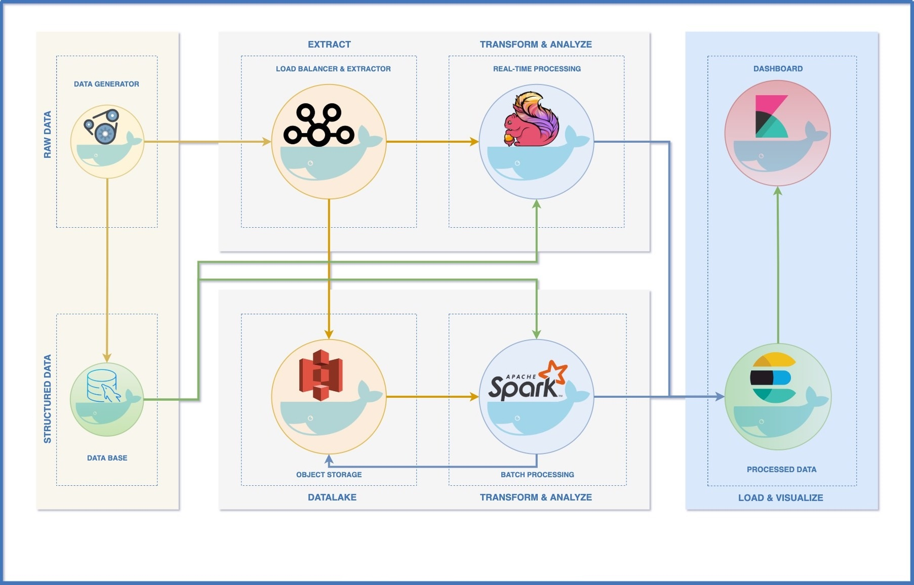

[](https://github.com/gmfaruk/dataplatform.git)

        

## Overview
Data platform  is a lambda architecture demo for data processing and analysis.

The objective of this project is to demonstrate an analytical platform model that is capable of processing data in real time and batch and visualizing the result using different types of technologies..


## Architecture


## Components

- ### Data Generator:
    It is a process developed in Python that reads a soccer game event dataset and sends the events to Kafka every 0.5 seconds. In addition, it reads some datasets (data of the matches, types of events, etc.), and saves it in MySql.

- ### MySql:
    MySql stores the data received from the Data Generator to consume it later in the Spark and Flink process.

- ### Apache Kafka:
    It receives the events in a topic to consume from the Flink process and stores them in S3 using Kafka connect.


- ### AWS S3 (localstack):
    S3 stores the data received from Kafka connect in a bucket to consume it later in batch processes (Spark).

- ### Apache Flink:
    The Flink process consumes Kafka topic and MySql tables (queries every 30 min) to analyze events in real time and inserts into Elasticsearch indexes.

- ### Apache Spark (Pending to implement):
    Spark reads data stored in S3 and MySql to analyze in batch mode and stores in Elasticsearch indexes.

- ### Elasticsearch:
    Elasticsearch stores the data analyzed in real time and batch mode.

- ### Kibana:
    Visualizes Elasticsearch data in a Dashboard.

## Run demo

### Requirements:
* [git](https://git-scm.com/book/en/v2/Getting-Started-Installing-Git)
* [docker](https://docs.docker.com/get-docker/)
* [docker-compose](https://docs.docker.com/compose/install/)

Clone repository
```
git clone https://github.com/gmfaruk/dataplatform.git
```

Move to project directory
```
cd dataplatform
```

Set execute permission to start and stop script
```
chmod +x start

chmod +x stop
```

Start dataplatform
```
./start

#or
bash start
```

Stop dataplatform
```
./stop

#or
bash stop
```

## Credits for docker images:
- [The Apache Software Foundation](https://github.com/apache)
- [Confluent Inc.](https://github.com/confluentinc)
- [LocalStack](https://github.com/localstack)
- [Bitnami](https://github.com/Bitnami)
- [Elastic](https://github.com/elastic)
